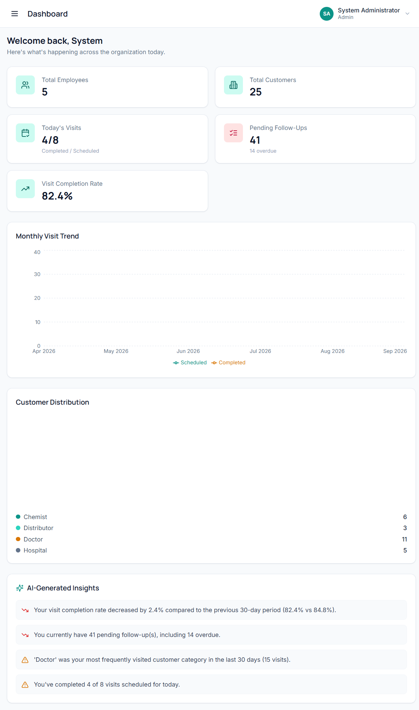
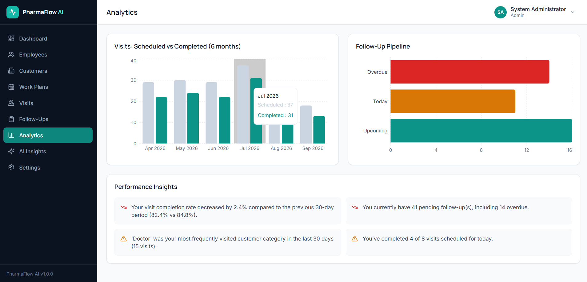
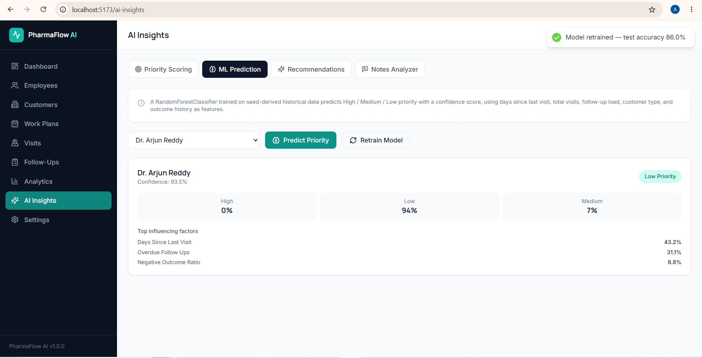
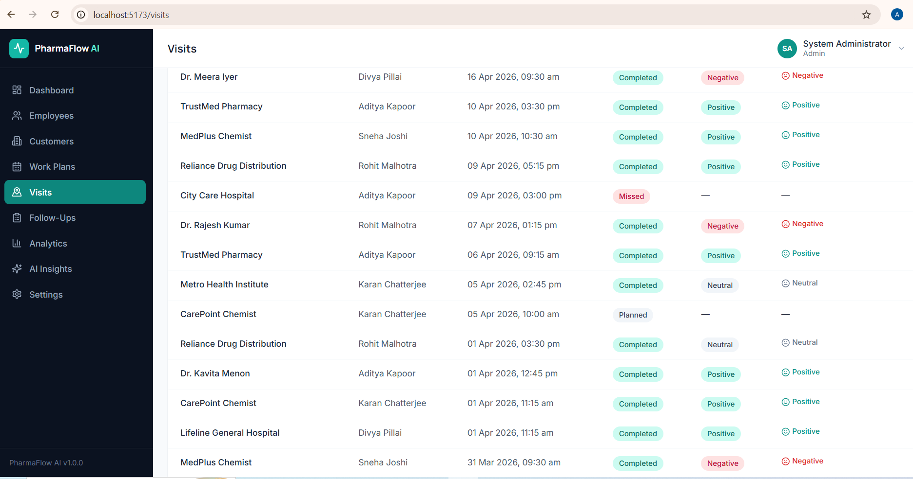

# PharmaFlow AI

### AI-Powered Pharmaceutical Field Force & Business Management Platform

PharmaFlow AI is a full-stack pharmaceutical field-force management platform designed to help pharmaceutical organizations manage medical representatives, healthcare customers, field visits, work plans, follow-ups, and business performance from a centralized system.

The platform combines traditional business workflows with lightweight, explainable AI/ML capabilities for customer prioritization, visit recommendations, analytics, and field-note analysis.

> **Portfolio Project:** Built as an AI & Data Science engineering project to demonstrate full-stack development, machine learning integration, data analytics, NLP, API design, and business-oriented product development.

---

## 📸 Application Screenshots

### Dashboard



### Analytics



### AI Insights



### Visit Management



---

## 🚀 Product Overview

Pharmaceutical field teams often manage large numbers of doctors, hospitals, chemists, and distributors while simultaneously tracking visits, follow-ups, work plans, and employee performance.

PharmaFlow AI brings these workflows together into a single platform and adds data-driven intelligence on top.

### The platform provides:

- 👥 Employee & medical representative management
- 🏥 Doctor, hospital, chemist & distributor management
- 📅 Daily work planning
- 📍 Customer visit management
- 🟢 Visit check-in / check-out
- 🔁 Follow-up management
- 📊 Business & performance analytics
- 🧠 Explainable customer prioritization
- 🤖 Machine-learning based priority prediction
- 🎯 Smart visit recommendations
- 📝 NLP-based visit-note analysis
- 🔐 JWT authentication & role-based access control

---

## ✨ Key Features

### 🔐 Authentication & Role-Based Access

- JWT-based authentication
- Protected API routes
- Role-based access control
- Separate Admin and Employee workflows
- Secure password hashing

### 👨‍💼 Employee Management

Administrators can:

- Create employees
- Manage employee accounts
- Assign territories
- View employee information
- Monitor field activity

### 🏥 Customer Management

Manage multiple pharmaceutical customer categories:

- Doctors
- Hospitals
- Chemists
- Distributors

Each customer can be associated with visits, follow-ups, activity history, and AI-generated priority information.

### 📅 Work Planning

Employees can manage daily work plans and customer assignments.

The system supports:

- Daily customer assignments
- Planned activities
- Completion tracking
- Work-plan status management

### 📍 Visit Management

Complete visit lifecycle:

```text
Schedule Visit
      ↓
Check In
      ↓
Conduct Visit
      ↓
Add Notes & Outcome
      ↓
Check Out
      ↓
Create Follow-up
```

Visit records include timestamps, customer information, employee information, outcomes, and notes.

### 🔁 Follow-Up Management

Follow-ups are automatically organized into:

- 🔴 Overdue
- 🟡 Today
- 🔵 Upcoming

This allows employees to quickly identify customers requiring attention.

### 📊 Analytics Dashboard

The platform generates analytics directly from database records, including:

- Visit activity
- Visit completion rates
- Customer distribution
- Follow-up pipeline
- Customer categories
- Employee activity
- Performance trends

---

# 🧠 AI & Machine Learning

One of the primary goals of PharmaFlow AI is to demonstrate how AI/ML can be integrated into a real business workflow rather than existing as a standalone model.

## 1. Explainable Customer Priority Engine

Each customer receives a priority score from **0–100**.

The score considers factors such as:

- Days since last visit
- Pending follow-ups
- Overdue follow-ups
- Customer category
- Visit frequency
- Historical visit outcomes

The system also provides a human-readable explanation of why a customer received the score.

Example:

```text
Priority Score: 87/100

Priority: HIGH

Reasons:
• Customer has not been visited recently
• Follow-up is overdue
• High historical interaction frequency
```

This makes the recommendation more interpretable than a simple black-box prediction.

---

## 2. Machine Learning Priority Prediction

PharmaFlow AI includes a `RandomForestClassifier` built with scikit-learn.

The model:

1. Generates initial synthetic, rule-informed historical data.
2. Extracts customer activity features.
3. Trains a Random Forest classifier.
4. Predicts customer priority.
5. Returns the predicted priority and confidence.
6. Exposes model information through the API.
7. Supports model retraining.

The ML layer is intentionally modular so that synthetic training data can later be replaced with real historical business data.

### Current ML Pipeline

```text
Customer Activity
       ↓
Feature Extraction
       ↓
Training Dataset
       ↓
Random Forest Classifier
       ↓
Priority Prediction
       ↓
Confidence + Feature Information
```

---

## 3. Smart Visit Recommendation Engine

The recommendation engine combines multiple signals:

- Rule-based customer priority
- ML prediction
- Follow-up urgency
- Recent visit history
- Employee territory relevance

It ranks customers and recommends the **top customers an employee should consider visiting next**.

Each recommendation includes an explanation rather than only returning a customer ID.

---

## 4. Data-Driven Performance Insights

Analytics are calculated from actual application database records.

Examples include:

- Visit completion rate
- Activity trends
- Pending follow-ups
- Overdue follow-ups
- Most-visited customer categories
- Employee activity

This connects the analytics layer directly to the application's operational data.

---

## 5. Local NLP Visit-Note Analyzer

The platform includes a lightweight local NLP analyzer for field-visit notes.

It can identify:

- Sentiment
- Follow-up requirements
- Relevant keywords

The current implementation uses a local keyword/lexicon-based approach and does not require a paid external AI API.

The service is modular and can later be replaced with an LLM-based implementation such as Gemini, OpenAI, or Ollama without changing the API contract.

---

# 🏗️ System Architecture

```text
┌──────────────────────────────────────────┐
│              React Frontend              │
│                                          │
│ Dashboard • Customers • Visits           │
│ Employees • Work Plans • Analytics       │
│ AI Insights • Follow-ups                 │
└──────────────────┬───────────────────────┘
                   │
                   │ REST API
                   ▼
┌──────────────────────────────────────────┐
│             FastAPI Backend              │
│                                          │
│ Authentication                           │
│ Employee Management                      │
│ Customer Management                      │
│ Visits • Work Plans • Follow-ups         │
│ Dashboard & Analytics                    │
└───────────────┬──────────────────────────┘
                │
        ┌───────┴────────┐
        ▼                ▼
┌──────────────┐  ┌──────────────────────┐
│   SQLite DB  │  │   AI / ML Services   │
│              │  │                      │
│ Employees    │  │ Priority Engine      │
│ Customers    │  │ Random Forest Model  │
│ Visits       │  │ Recommendation Engine│
│ Follow-ups   │  │ Analytics Engine     │
│ Work Plans   │  │ NLP Notes Analyzer   │
└──────────────┘  └──────────────────────┘
```

---

# 🛠️ Tech Stack

| Layer | Technologies |
|---|---|
| Frontend | React, Vite, Tailwind CSS |
| Routing | React Router |
| UI / Charts | Recharts, Lucide Icons |
| Backend | Python, FastAPI |
| ORM | SQLAlchemy |
| Validation | Pydantic |
| Authentication | JWT, bcrypt |
| Machine Learning | scikit-learn |
| Data Processing | pandas, NumPy |
| Model Persistence | joblib |
| NLP | Local keyword / lexicon analysis |
| Database | SQLite |
| API Style | REST |
| Version Control | Git & GitHub |

---

# 📁 Project Structure

```text
pharmaflow-ai/
│
├── backend/
│   ├── app/
│   │   ├── core/
│   │   │   ├── config.py
│   │   │   └── security.py
│   │   │
│   │   ├── models/
│   │   │   └── models.py
│   │   │
│   │   ├── schemas/
│   │   │   └── schemas.py
│   │   │
│   │   ├── routers/
│   │   │   ├── ai.py
│   │   │   ├── auth.py
│   │   │   ├── customers.py
│   │   │   ├── dashboard.py
│   │   │   ├── employees.py
│   │   │   ├── follow_ups.py
│   │   │   ├── visits.py
│   │   │   └── work_plans.py
│   │   │
│   │   ├── services/
│   │   │   ├── priority_engine.py
│   │   │   ├── ml_priority_model.py
│   │   │   ├── recommendation_engine.py
│   │   │   ├── analytics_engine.py
│   │   │   └── notes_analyzer.py
│   │   │
│   │   ├── database.py
│   │   ├── seed.py
│   │   └── main.py
│   │
│   └── requirements.txt
│
├── frontend/
│   ├── src/
│   │   ├── api/
│   │   ├── components/
│   │   ├── context/
│   │   ├── pages/
│   │   ├── utils/
│   │   ├── App.jsx
│   │   ├── index.css
│   │   └── main.jsx
│   │
│   ├── package.json
│   └── vite.config.js
│
├── docs/
│   └── API.md
│
├── .gitignore
└── README.md
```

---

# 🚀 Getting Started

## Prerequisites

Make sure you have:

- Python 3.10+
- Node.js 18+
- npm

---

## 1. Clone the repository

```bash
git clone https://github.com/Abhishek-palakkeel/pharmaflow.ai.git
cd pharmaflow.ai
```

---

## 2. Start the Backend

```bash
cd backend
```

Create a virtual environment:

### Windows

```powershell
python -m venv venv
.\venv\Scripts\activate
```

### macOS / Linux

```bash
python3 -m venv venv
source venv/bin/activate
```

Install dependencies:

```bash
pip install -r requirements.txt
```

Start FastAPI:

```bash
uvicorn app.main:app --reload --port 8000
```

Backend:

```text
http://localhost:8000
```

Interactive API documentation:

```text
http://localhost:8000/docs
```

On first startup, the application automatically initializes the demo database, seeds demo records, and trains the ML priority model.

---

## 3. Start the Frontend

Open a second terminal:

```bash
cd frontend
npm install
npm run dev
```

Open:

```text
http://localhost:5173
```

The Vite development server proxies `/api` requests to the FastAPI backend.

---

# 🔑 Demo Credentials

| Role | Email | Password |
|---|---|---|
| Admin | `admin@pharmaflow.ai` | `Admin@123` |
| Employee | `aditya.kapoor@pharmaflow.ai` | `Employee@123` |
| Employee | `sneha.joshi@pharmaflow.ai` | `Employee@123` |

Additional demo employee accounts are seeded automatically.

> These credentials are for the local demo environment only.

---

# 📡 API

PharmaFlow AI exposes REST endpoints for:

- Authentication
- Employees
- Customers
- Work Plans
- Visits
- Follow-ups
- Dashboard
- AI insights

Interactive API documentation is available through FastAPI Swagger UI:

```text
http://localhost:8000/docs
```

Detailed endpoint documentation is also available in:

```text
docs/API.md
```

---

# 🔬 AI Service Design

The AI layer is intentionally separated from the API layer.

```text
backend/app/services/

priority_engine.py
        ↓
Explainable customer scoring

ml_priority_model.py
        ↓
Random Forest classification

recommendation_engine.py
        ↓
Customer visit recommendations

analytics_engine.py
        ↓
Business performance insights

notes_analyzer.py
        ↓
Local NLP analysis
```

This separation allows individual AI components to be improved or replaced without restructuring the entire application.

---

# 🔮 Future Improvements

The current architecture provides a foundation for further development.

Potential future improvements include:

- PostgreSQL production database
- Real pharmaceutical sales/CRM datasets
- Model training using real historical field activity
- Advanced customer churn prediction
- Territory optimization
- Route optimization
- LLM-powered field-note analysis
- Retrieval-Augmented Generation for pharmaceutical knowledge
- Advanced geospatial analytics
- Mobile application for medical representatives
- Cloud deployment
- Automated ML model monitoring

---

# ⚠️ AI & Data Disclaimer

The current machine-learning model uses synthetic, rule-informed training data for demonstration purposes.

It should **not** be interpreted as a validated production pharmaceutical business prediction system.

Similarly, the NLP and recommendation features are designed to demonstrate AI engineering and decision-support workflows rather than replace professional business judgment.

---

# 📌 Project Highlights

PharmaFlow AI demonstrates practical integration of:

- Full-stack web development
- REST API architecture
- Authentication & authorization
- Relational database design
- Machine learning
- Explainable scoring
- Recommendation systems
- Data analytics
- Natural language processing
- Modular AI service architecture
- Business workflow automation

---

# 📄 License

This is a personal portfolio project created for educational and demonstration purposes.

---

## 👨‍💻 Author

**Abhishekh P**

Artificial Intelligence & Data Science Engineer

GitHub:  
https://github.com/Abhishek-palakkeel

---

⭐ If you find the project interesting, consider giving the repository a star.